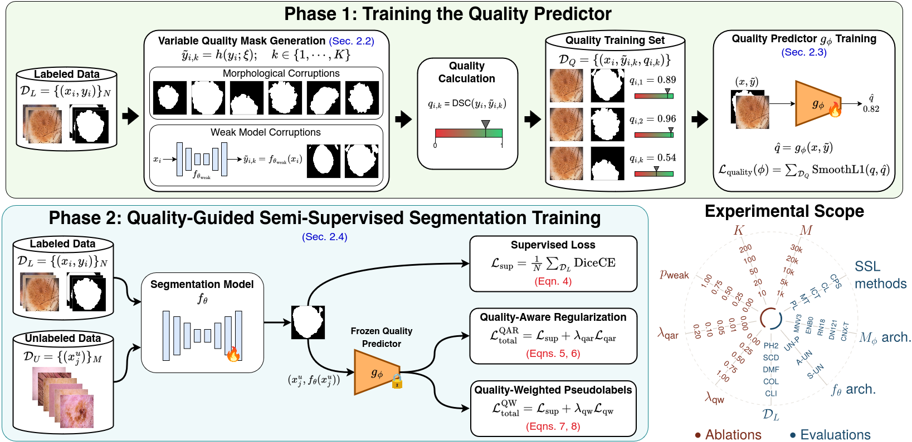

# Quality-Guided Semi-Supervised Learning for Medical Image Segmentation

[](https://github.com/astral-sh/ruff) [](https://conferences.miccai.org/2026/) [](https://arxiv.org/abs/2606.01753) [](https://www.python.org/downloads/release/python-3100/) [](LICENSE)
<!-- [](HUGGINGFACE_URL) -->

> *Early-accept at MICCAI 2026 (top 9% of 4,601 submissions).*

A quality-guided approach to semi-supervised medical image segmentation. A dedicated segmentation quality predictor <i>g<sub>&phi;</sub></i> is trained on variable-quality masks to estimate segmentation quality from image-mask pairs without requiring ground truth. The frozen <i>g<sub>&phi;</sub></i> then guides semi-supervised training of the segmentation network <i>f<sub>&theta;</sub></i> on unlabeled data through two complementary mechanisms:
- **QAR**: a differentiable quality-aware regularization that encourages <i>f<sub>&theta;</sub></i> to produce masks that <i>g<sub>&phi;</sub></i> scores as high quality, or
- **PL-QW**: quality-based pseudolabel reweighting that uses <i>g<sub>&phi;</sub></i>'s score of each pseudolabel as a sample weight during <i>f<sub>&theta;</sub></i> training.

Both mechanisms are drop-in enhancements to existing semi-supervised learning frameworks.

# Overview



# Repository Structure

Training is organized around two phases:
- [**Phase 1**] Train <i>g<sub>&phi;</sub></i> : generate Variable Quality Masks and train the quality predictor. Done using `train_mq.sh`.
- [**Phase 2**] Train <i>f<sub>&theta;</sub></i> : use the frozen <i>g<sub>&phi;</sub></i> to guide semi-supervised training of the segmentation network. Done using `train_SSL_methods.sh`.

```
.
├── requirements.txt          # Python dependencies
├── train_mq.sh               # Phase 1: train g_φ and weak models
├── test_mq.sh                # Evaluate trained g_φ
├── train_SSL_methods.sh      # Phase 2: semi-supervised training of f_θ
│
├── prepare_datasets/         # Resize images/masks and generate train/val/test CSVs for labeled datasets
│   ├── utils.py              # Shared resize utility for image-mask pairs
│   ├── prepare_PH2.py        # Prepares PH2: resize and generate split CSVs
│   └── PH2_segs_metadata/    # Precomputed train/val/test split CSVs for PH2
│
├── prepare_unsupervised_images/            # Resize and generate metadata CSVs for unlabeled datasets
│   ├── create_isic2020_subsets.py          # Creates stratified ISIC2020 subsets (1k–30k)
│   ├── create_colon_unlabeled_metadata.py  # Generates metadata CSV for unlabeled colonoscopy images
│   ├── resize_isic2020_images.py           # Resizes ISIC2020 images to 224×224
│   ├── resize_colon_unlabeled_images.py    # Resizes unlabeled colonoscopy images to 224×224
│   ├── colonoscopy_unlabeled_metadata.csv  # Precomputed metadata CSV for unlabeled colonoscopy images
│   └── ISIC2020_train_subsets/             # Precomputed ISIC2020 subset CSVs (1k, 5k, 10k, 20k, 30k)
│
├── data/                          # Phase 1: VQM generation for g_φ training
│   ├── corruption_ops.py          # Synthetic mask corruption operations
│   ├── vqm_generator.py           # Variable Quality Mask (VQM) generator
│   ├── weak_model_corruption.py   # Weak model predictions as corruptions
│   ├── mq_dataset.py              # Dataset for g_φ training
│   └── seg_datasets.py            # D_L and D_U datasets for f_θ training
│
├── models/
│   ├── quality_predictor.py  # g_φ: (image, mask) → predicted Dice score
│   ├── ema.py                # EMA wrapper for f_θ (mean teacher methods)
│   ├── swin_unet.py          # Swin-UNet architecture for f_θ
│   └── swin_unet_utils.py    # Pretrained Swin Transformer weight loading
│
└── training/
    ├── train_mq.py           # Phase 1: g_φ training script
    ├── test_mq.py            # g_φ evaluation (MAE, Pearson correlation)
    ├── train_semisup.py      # Phase 2: semi-supervised training of f_θ
    ├── losses.py             # Loss functions (Dice, CE, combo, SmoothL1)
    ├── metrics.py            # Dice, Jaccard, pixel accuracy, F1
    ├── schedulers.py         # Unsupervised loss weight ramp-up scheduler
    ├── eval_utils.py         # Validation and test evaluation utilities
    └── methods/
        └── ours.py           # QAR and PL-QW implementations
```


# Usage

Before running, update the dataset CSV paths and (if using Swin-UNet) the pretrained weights path at the top of each shell script.

## Phase 1: Train and evaluate the segmentation quality predictor (<i>g<sub>&phi;</sub></i>):
```bash
bash train_mq.sh
bash test_mq.sh
```

## Phase 2: Train and evaluate the segmentation models (<i>f<sub>&theta;</sub></i>) using semi-supervised methods:
```bash
bash train_SSL_methods.sh
```

# Citation

If you find our paper useful, please consider citing:

```html
Abhishek, K., Hamarneh, G. (2026). Quality-Guided Semi-Supervised Learning for Medical Image Segmentation. In: Medical Image Computing and Computer Assisted Intervention – MICCAI 2026. MICCAI 2026. Lecture Notes in Computer Science. Springer, Cham.
```

Or in BibTeX format:
```bibtex
@inproceedings{abhishek2026qgssl,
  title     = {Quality-Guided Semi-Supervised Learning for Medical Image Segmentation},
  author    = {Abhishek, Kumar and Hamarneh, Ghassan},
  booktitle = {Medical Image Computing and Computer Assisted Intervention (MICCAI)},
  year      = {2026},
  publisher = {Springer}
}
```

## Installation

<details><summary>Click to expand</summary>

**Requirements**:
- Python 3.10
- PyTorch 2.9.0

**Dependencies**:

```bash
pip install -r requirements.txt
```

**Model implementations:** 
- All <i>g<sub>&phi;</sub></i> backbones are sourced from [`timm`](https://github.com/huggingface/pytorch-image-models).
- <i>f<sub>&theta;</sub></i> architectures:
    - U-Net++ is sourced from [`segmentation-models-pytorch`](https://github.com/qubvel/segmentation_models.pytorch).
    - Attention U-Net is sourced from a [yet-to-be-merged PR](https://github.com/qubvel-org/segmentation_models.pytorch/pull/1243) in [`segmentation-models-pytorch`](https://github.com/qubvel/segmentation_models.pytorch).
    - Swin-UNet is a custom implementation in `models/swin_unet.py` and with utilities in `models/swin_unet_utils.py`. I am planning to open a PR to add Swin-UNet to [`segmentation-models-pytorch`](https://github.com/qubvel/segmentation_models.pytorch) and will update the link once the PR is opened.
      - **Swin-UNet** requires pretrained Swin Transformer weights. Download `swin_tiny_patch4_window7_224_22k.pth` from the official Swin Transformer repository ([URL](https://drive.google.com/drive/folders/1UC3XOoezeum0uck4KBVGa8osahs6rKUY)) and place it at: `checkpoints/pretrained/swin_tiny_patch4_window7_224_22k.pth`. This path is configured by `SWIN_PRETRAINED_PATH` in `train_SSL_methods.sh`.

</details>

## Datasets

<details><summary>Click to expand</summary>

The experiments use the following labeled datasets (D_L) and unlabeled datasets (D_U):

**Labeled datasets:**
- Dermatology: 
  - **PH2**: [[Download]](https://www.fc.up.pt/addi/ph2%20database.html)
  - **SCD (Skin Cancer Detection)**: [[Download]](https://vip.uwaterloo.ca/skin-cancer-detection)
  - **DermoFit**: [[Download](https://licensing.edinburgh-innovations.ed.ac.uk/product/dermofit-image-library); requires academic license]
- Colonoscopy: 
  - **CVC-ColonDB**: [[Download]](https://pages.cvc.uab.es/CVC-Colon/index.php/databases)
  - **CVC-ClinicDB**: [[Download]](https://pages.cvc.uab.es/CVC-Colon/index.php/databases)

**Unlabeled datasets:**
- **Dermatology**: 
  - **ISIC2020** (training split only; JPEG format): [[Download]](https://challenge.isic-archive.com/data/#2020)
- **Colonoscopy**: 
  - **Polyp-Box-Seg**: [[Download]](http://www.igb.uci.edu/colonoscopy/AI_for_GI2.html)

Once downloaded, organize and preprocess each dataset into train/val/test CSV files listing image and mask paths. The shell scripts expect these CSVs at paths configured by the variables at the top of each script; e.g., `TRAIN_CSV`, `VAL_CSV`, `TEST_CSV`, `UNLABELED_CSV_5K` (for 5k samples from ISIC2020, serving as D_U in our dermatology experiments).

See `prepare_datasets/` for PH2 example. The `prepare_unsupervised_images/` directory contains both ISIC2020 and Polyp-Box-Seg scripts and metadata.

</details>

## Pretrained Weights

<details><summary>Click to expand</summary>
Pre-trained weights for segmentation models <i>f<sub>&theta;</sub></i> trained with QAR and PL-QW (see `training/methods/ours.py`) will soon be uploaded to the HuggingFace Hub. I will update the link once the weights are uploaded.
</details>
